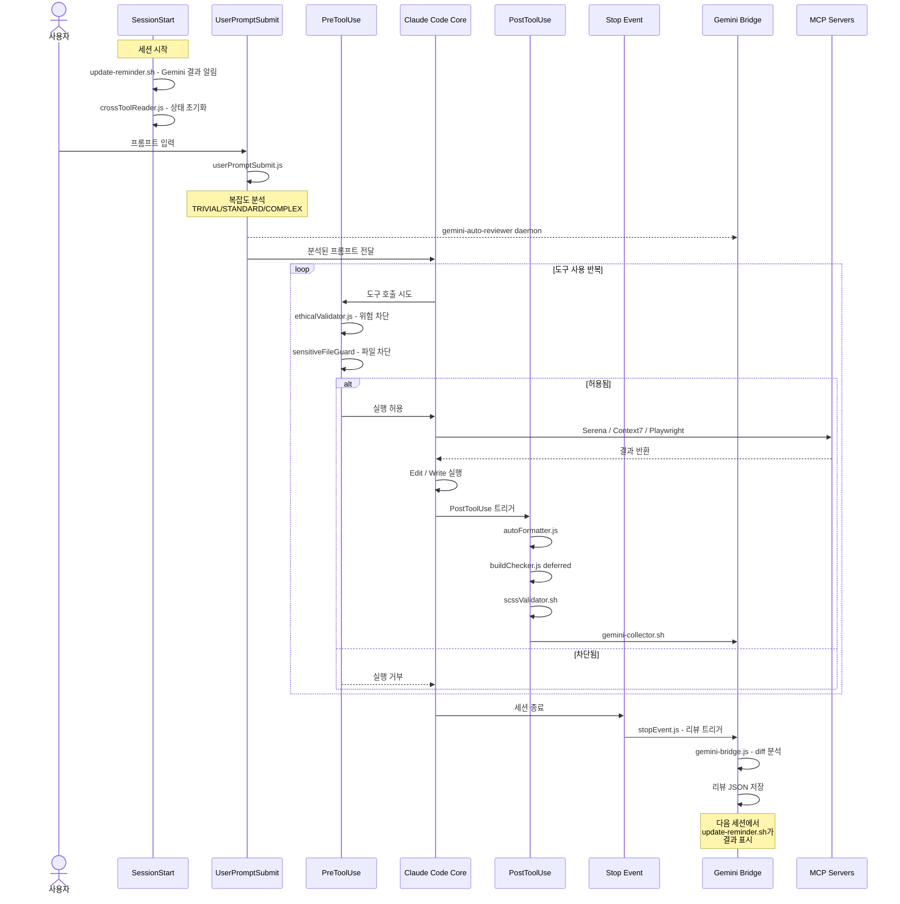
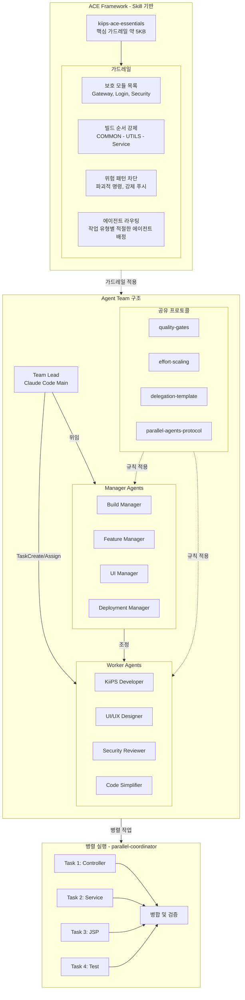
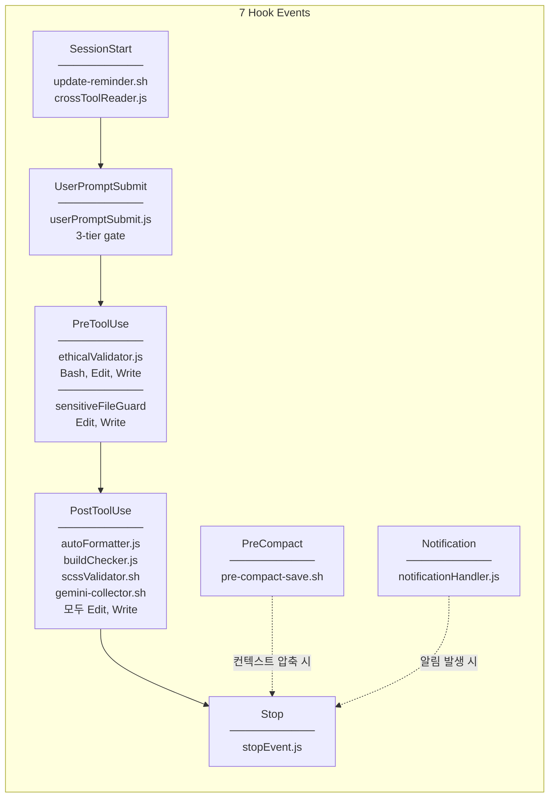

# KiiPS Claude Code System Architecture

## System Overview Diagram

```mermaid
flowchart TB
    subgraph USER["사용자 입력"]
        prompt["프롬프트 입력"]
        slash["슬래시 커맨드<br/>/commit, /review, /deploy..."]
    end

    %% ===== SESSION START =====
    subgraph SESSION_START["SessionStart Event"]
        direction TB
        updateReminder["update-reminder.sh<br/>Gemini 분석 결과 알림"]
        crossToolReader["crossToolReader.js<br/>세션 상태 초기화"]
    end

    %% ===== USER PROMPT SUBMIT =====
    subgraph UPS["UserPromptSubmit Event"]
        direction TB
        userPromptSubmit["userPromptSubmit.js<br/>3-tier 복잡도 게이트<br/>TRIVIAL / STANDARD / COMPLEX"]
        geminiReview["Gemini Auto-Review<br/>프롬프트 분석 daemon"]
    end

    %% ===== PRE TOOL USE =====
    subgraph PTU["PreToolUse Event"]
        direction TB
        ethicalValidator["ethicalValidator.js<br/>Bash, Edit, Write 필터<br/>위험 패턴 차단 fail-close"]
        sensitiveFileGuard["Sensitive File Guard<br/>Edit, Write 차단<br/>.env, secrets, credentials,<br/>app-kiips/stg/local.properties"]
    end

    %% ===== CLAUDE CODE CORE =====
    subgraph CORE["Claude Code Core - Opus 4.6"]
        direction TB
        claudeMD["CLAUDE.md<br/>프로젝트 규칙"]
        memory["Auto Memory<br/>~/.claude/projects/memory/"]
        planMode["Plan Mode<br/>설계 - 승인 - 구현"]

        subgraph TOOLS["Built-in Tools"]
            bash["Bash"]
            edit["Edit / Write"]
            read["Read / Glob / Grep"]
            agent["Agent Sub-agent"]
        end
    end

    %% ===== POST TOOL USE =====
    subgraph POTU["PostToolUse Event - Edit, Write"]
        direction TB
        autoFormatter["autoFormatter.js<br/>Java/JS/SCSS 자동 포맷"]
        buildChecker["buildChecker.js<br/>Deferred Mode<br/>Java 3+ 파일시 Maven compile"]
        scssValidator["scssValidator.sh<br/>다크테마 규칙 검증<br/>data-theme=dark 강제"]
        geminiCollector["gemini-collector.sh<br/>변경 파일 수집<br/>Gemini Bridge 전달"]
    end

    %% ===== STOP EVENT =====
    subgraph STOP["Stop Event"]
        stopEvent["stopEvent.js<br/>세션 종료 처리<br/>Gemini 리뷰 트리거"]
    end

    %% ===== OTHER EVENTS =====
    subgraph OTHER["Other Events"]
        direction TB
        preCompact["PreCompact<br/>pre-compact-save.sh<br/>컨텍스트 저장"]
        notification["Notification<br/>notificationHandler.js<br/>macOS 알림"]
    end

    %% ===== GEMINI BRIDGE =====
    subgraph GEMINI["Gemini Bridge - External AI"]
        direction TB
        geminiDaemon["gemini-auto-reviewer.js<br/>Daemon PID file<br/>보안/품질 리뷰"]
        geminiBridge["gemini-bridge.js<br/>Gemini CLI 연동<br/>git diff 분석"]
        geminiReviews["reviews/<br/>JSON 리뷰 파일<br/>7일 자동 삭제"]
    end

    %% ===== SKILLS =====
    subgraph SKILLS["Skills - 27 Project + 9 Global"]
        direction TB

        subgraph SKILL_DOMAIN["도메인 스킬"]
            aceEssentials["kiips-ace-essentials<br/>ACE 가드레일"]
            pagePattern["kiips-page-pattern-guide"]
            searchFilter["kiips-search-filter-guide"]
            buttonGuide["kiips-button-guide"]
            realgridGuide["kiips-realgrid-guide"]
            backendGuide["kiips-backend-guidelines"]
            frontendGuide["kiips-frontend-guidelines"]
            mybatisGuide["kiips-mybatis-guide"]
            securityGuide["kiips-security-guide"]
            modalGuide["kiips-regist-modal-guide"]
        end

        subgraph SKILL_INFRA["인프라 스킬"]
            mavenBuilder["kiips-maven-builder"]
            serviceDeployer["kiips-service-deployer"]
            buildDeploy["kiips-build-deploy"]
            startup["kiips-startup"]
            logAnalyzer["kiips-log-analyzer"]
            apiTester["kiips-api-tester"]
            testRunner["kiips-test-runner"]
        end

        subgraph SKILL_UI["UI 스킬"]
            uiComponent["kiips-ui-component-builder"]
            scssTheme["kiips-scss-theme-manager"]
            darktheme["kiips-darktheme-applier"]
            responsive["kiips-responsive-validator"]
            a11y["kiips-a11y-checker"]
        end

        subgraph SKILL_PLAN["계획/검증 스킬"]
            featurePlanner["kiips-feature-planner"]
            detailPlanner["kiips-detail-page-planner"]
            dbVerify["kiips-database-verification"]
            commonPatterns["kiips-common-patterns"]
            parallelCoord["parallel-coordinator<br/>ACE Framework"]
        end

        subgraph SKILL_GLOBAL["글로벌 스킬"]
            skillCreator["skill-creator"]
            hookCreator["hook-creator"]
            subagentCreator["subagent-creator"]
            cliOrchestrator["cli-orchestrator"]
            agentImprove["agent-improvement"]
            agentObserve["agent-observability"]
            verifyLoop["verification-loop"]
        end
    end

    %% ===== COMMANDS =====
    subgraph COMMANDS["Slash Commands - 14 Project + 6 Global"]
        direction TB
        cmdDev["개발: /my-workflow, /commit-push-pr<br/>/deploy-with-tests, /draft-commits"]
        cmdQuality["품질: /review, /simplify-code<br/>/test-coverage, /scope-lock"]
        cmdOps["운영: /check-health, /service-status<br/>/view-logs, /diagnose"]
        cmdGemini["Gemini: /gemini-scan, /eval<br/>/gemini-handoff"]
        cmdGlobal["글로벌: /config-backup, /dev-docs<br/>/resume, /save-and-compact<br/>/update-dev-docs"]
    end

    %% ===== AGENTS =====
    subgraph AGENTS["Sub-Agents"]
        direction TB

        subgraph AGENT_SPECIALIST["전문 에이전트"]
            devAgent["KiiPS Developer<br/>코딩/디버깅"]
            uiAgent["KiiPS UI/UX Designer<br/>JSP/Bootstrap/RealGrid"]
            archAgent["KiiPS Architect<br/>시스템 설계"]
            secAgent["Security Reviewer<br/>보안 검증"]
            codeSimp["Code Simplifier<br/>리팩토링"]
            realgridGen["RealGrid Generator<br/>테이블 자동 생성"]
            checklistGen["Checklist Generator<br/>검증 체크리스트"]
        end

        subgraph AGENT_MANAGER["매니저 에이전트"]
            buildMgr["Build Manager"]
            deployMgr["Deployment Manager"]
            featureMgr["Feature Manager"]
            uiMgr["UI Manager"]
        end

        subgraph AGENT_SHARED["공유 프로토콜"]
            qualityGates["quality-gates<br/>품질 기준"]
            effortScaling["effort-scaling<br/>리소스 배분"]
            delegationTpl["delegation-template<br/>작업 위임 표준"]
            parallelProto["parallel-agents-protocol<br/>병렬 실행 안전"]
            aceShared["ace-framework<br/>ACE 가드레일 공유"]
        end
    end

    %% ===== MCP SERVERS =====
    subgraph MCP["MCP Servers"]
        direction TB
        serena["Serena<br/>Semantic Code Tools<br/>심볼릭 코드 분석"]
        context7["Context7<br/>라이브러리 문서 검색"]
        playwright["Playwright<br/>브라우저 자동화"]
        chromeExt["Claude in Chrome<br/>Chrome 브라우저 제어"]
    end

    %% ===== FLOW CONNECTIONS =====
    prompt --> SESSION_START
    slash --> COMMANDS
    SESSION_START --> UPS
    UPS --> PTU
    PTU -->|"허용"| CORE
    PTU -->|"차단"| prompt

    CORE --> POTU
    CORE --> SKILLS
    CORE --> AGENTS
    CORE --> MCP
    CORE --> COMMANDS

    POTU --> geminiCollector
    geminiCollector --> GEMINI

    CORE -->|"세션 종료"| STOP
    STOP --> GEMINI

    CORE -->|"컨텍스트 압축"| preCompact
    CORE -->|"알림 발생"| notification

    %% Gemini feedback loop
    GEMINI -->|"리뷰 결과"| updateReminder
    updateReminder -->|"다음 세션에 표시"| prompt
```

## Event Lifecycle - 시간순

## ACE Framework and Agent Team 구조

## Hook 실행 상세

## 수치 요약

| 구성요소 | 수량 | 상세 |
|---------|------|------|
| **Hook Events** | 7 | SessionStart, UserPromptSubmit, PreToolUse, PostToolUse, Stop, PreCompact, Notification |
| **Hook Scripts** | 11 | .js 8개, .sh 3개 |
| **Project Skills** | 27 | 도메인 10, 인프라 7, UI 5, 계획/검증 5 |
| **Global Skills** | 9 | 범용 도구 - skill/hook/agent creator, orchestrator 등 |
| **Project Commands** | 14 | 개발 4, 품질 4, 운영 4, Gemini 2 |
| **Global Commands** | 6 | config-backup, dev-docs, resume, save-and-compact 등 |
| **Sub-Agents** | 11 | 전문 에이전트 7, 매니저 4 |
| **Shared Protocols** | 5 | quality-gates, effort-scaling, delegation, parallel, ace |
| **MCP Servers** | 4 | Serena, Context7, Playwright, Claude-in-Chrome |
| **Gemini Bridge** | 3 | daemon, bridge, collector |
